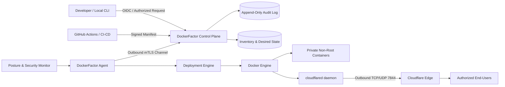

# DockerFactor — Architecture Specification: Zero-Trust VPS Provisioning, Cloudflare Tunnels & Hardened CI/CD

**Status:** Architecture vision and design draft — not fully implemented
**Classification:** Open Source Technical Specification  
**Author:** Miguel Valdez ([@migueval](https://github.com/migueval))  
**License:** MIT  

---

## 1. Purpose

> This document describes the intended target architecture. It is not a statement that every component or security property already exists in the current prototype. See the implementation-status section below and the README command matrix for current behavior.

**DockerFactor** is an open-source automation platform designed to transform a fresh Linux VPS into a reproducible, isolated, observable, and hardened runtime environment for enterprise application containers.

Its objective goes beyond simply installing Docker Engine. It establishes and maintains a verifiable security baseline throughout the entire server lifecycle:

- Initial host provisioning & hardening;
- Secure VPS agent enrollment via mTLS;
- Package and dependency verification;
- Application container deployment;
- Controlled ingress publishing via Cloudflare Tunnels (`cloudflared`);
- Remote administration without exposing public SSH ports;
- Automated credential rotation;
- Real-time observability and drift detection;
- Zero-downtime rollouts & automatic rollbacks;
- Secure server decommissioning.

DockerFactor functions as an independent, reusable infrastructure layer. Applications running on the VPS maintain complete independence from DockerFactor; the engine manages infrastructure, networking, artifacts, and deployments without leaking business domain rules into hosted applications.

### 1.1 Current implementation status

The first functional increment contains a clean Core/Engine/CLI separation, a versioned application manifest, strict YAML parsing and a read-only project inspection command. Hardening generators, Docker deployment, ingress adapters, the control plane, resident VPS agent, cryptographic enrollment, continuous reconciliation, append-only audit logging, signed artifact enforcement and automatic rollback remain roadmap work.

Normative terms such as MUST and SHOULD in this document define acceptance criteria for the target architecture. They do not certify the current implementation.

---

## 2. Expected Outcome

Upon successful provisioning, the target server MUST satisfy the following baseline conditions:

1. **Zero Public Inbound Ports:** No application or management ports (SSH, HTTP/S) are accessible from the public Internet.
2. **Private Container Networking:** Applications reside exclusively on internal, isolated Docker bridge networks.
3. **Outbound Cloudflare Tunnel Ingress:** `cloudflared` maintains outbound connections to Cloudflare Edge servers, publishing ONLY explicitly authorized routes.
4. **Unique Cryptographic Identity:** Every VPS possesses an isolated, revocable keypair and agent certificate.
5. **Immutable Artifacts:** Deployed containers are versioned and pinned by sha256 digests (`image@sha256:...`).
6. **Least Privilege Execution:** Containers execute as non-root users (`USER 10001`, `readOnlyRootFilesystem: true`, `dropCapabilities: [ALL]`) following OWASP ASVS v4.0 security best practices.
7. **Append-Only Audit Logging:** Every administrative mutation produces an immutable audit record.
8. **Automated Rollback:** Defective deployments automatically trigger a rollback to the previous stable release.

---

## 3. Architectural Principles

### 3.1 Zero-Trust & Least Privilege
No VPS, agent, developer, or workflow is trusted based on network location. Every operation MUST be authenticated, authorized, scoped, and audited.

### 3.2 Server-Initiated Connectivity (Outbound-Only)
The VPS initiates all outbound connections toward the Control Plane and Cloudflare Edge. Normal operations NEVER accept inbound SSH or HTTP connections from the public Internet.

### 3.3 Declarative Desired State
Deployments are defined using a versioned YAML manifest. The DockerFactor Agent compares the desired state with the observed state, executing only the necessary reconciliation actions.

### 3.4 Single-Tenant Instance Isolation
Each environment or client receives:
- Dedicated VPS instance;
- Independent outbound Cloudflare Tunnel;
- Scoped cryptographic agent identity;
- Scoped API tokens;
- Isolated volumes and container networks.

### 3.5 Verifiable Security Baseline
DockerFactor verifies firewall rules (UFW/nftables/iptables) locally from the host and validates zero public port exposure via out-of-band external port scans.

### 3.6 Modular Ingress Abstraction
While Cloudflare Tunnels (`cloudflared`) serve as the default zero-inbound ingress provider, the ingress architecture is fully decoupled via an abstract ingress adapter interface. This enables seamless support for alternative mesh networks (Tailscale, WireGuard) or local reverse proxies without breaking core deployment workflows.

### 3.7 Declarative Reconciliation & Drift Control
The agent continuously reconciles the observed runtime state (active Docker containers, UFW firewall rules, tunnel bindings) against the declared manifest state. Any manual out-of-band mutations or container drifts are automatically detected, logged, and corrected.

### 3.8 Shared Responsibility Model & Declarative App Spec
DockerFactor strictly separates application developer responsibilities from platform infrastructure security:
- **Developer Responsibility:** Ensuring application code compiles, is dockerizable, and declaring the execution build step (`build`), start command (`command`), and designated listening port (`port`) in `dockerfactor.yaml`.
- **DockerFactor Responsibility:** Enforcing Zero-Trust host firewalling (UFW zero-inbound), container security profiles (`USER 10001`, `read_only: true`, `tmpfs /tmp`), and orchestrating encrypted outbound mTLS & Cloudflare Ingress tunnels.

---

## 4. Logical Architecture Model



---

## 5. Core Components

### 5.1 Bootstrap Installer (`install.sh`)
Single-line VPS installation script:
- Verifies Linux OS distribution (Ubuntu LTS / Debian), architecture, RAM, and disk space.
- Installs Docker Engine, Docker Compose V2, and `cloudflared` from authenticated repositories.
- Applies UFW firewall baseline (**Deny All Inbound**).
- Generates local agent keypairs and initiates cryptographic enrollment.

### 5.2 DockerFactor Agent
Resident daemon on each VPS (written in C# .NET 10 Native AOT / Go).
- Maintains outbound mTLS channel.
- Reconciles desired manifest state with actual container state.
- Executes with minimal privileges, delegating root operations to a minimal helper process.

### 5.3 Deployment & Hardening Engine
Parses declarative YAML manifests and enforces mandatory container security profiles:
- Non-root user `USER 10001`.
- `readOnlyRootFilesystem: true` with automatic `tmpfs` mounts (e.g. `/tmp:rw,noexec,nosuid`, `/var/tmp`) per technology stack (Node.js, Python, .NET).
- `noNewPrivileges: true`.
- `dropCapabilities: [ALL]`.
- Enforces strict memory, CPU, and PID limits.
- Blue/Green rollout strategy with automated health check validations and rollbacks.

### 5.4 Cloudflare Adapter
Manages Cloudflare Tunnel routing:
- Creates and binds outbound tunnels via `cloudflared`.
- Automatically maps internal container endpoints (e.g. `http://container:8080`) to public HTTPS subdomains.
- Enables automatic SSL/TLS certificate issuance and Edge Web Application Firewall (WAF) protection.

---

## 6. Declarative Manifest Specification (`ApplicationDeployment`)

```yaml
apiVersion: dockerfactor.org/v1alpha1
kind: ApplicationDeployment
metadata:
  environment: production
  application: identity-service
  version: 1.4.2
spec:
  image:
    reference: ghcr.io/migueval/identity-service
    digest: sha256:e3b0c44298fc1c149afbf4c8996fb92427ae41e4649b934ca495991b7852b855
    signaturePolicy: required
  runtime:
    user: 10001
    readOnlyRootFilesystem: true
    noNewPrivileges: true
    dropCapabilities:
      - ALL
    memory: 512Mi
    cpu: "1.0"
    pids: 256
  health:
    readinessPath: /health/ready
    livenessPath: /health/live
    timeoutSeconds: 5
  routing:
    hostname: identity.example.com
    internalService: http://identity:8080
  rollout:
    strategy: blueGreen
    stabilizationSeconds: 30
    automaticRollback: true
```

---

## 7. Implementation Phases

- **Phase 0 — Threat Model & Specifications:** Define YAML schemas, mTLS enrollment protocols, and Zero-Trust policies.
- **Phase 1 — Bootstrap & UFW Hardening:** `install.sh` script, auto-installation of Docker/Compose/cloudflared, and firewall zero-inbound policy.
- **Phase 2 — Core CLI & Hardening Generator:** Local CLI in .NET 10 Native AOT (`docker-factor init/deploy`) with hardening templates for .NET, Node, and Go.
- **Phase 3 — Tunnel Router & CI/CD Generator:** Subdomain routing via Cloudflare API and GitHub Actions workflow generator (`.github/workflows/deploy.yml`).
- **Phase 4 — Terminal UI & 12-Factor Auditor:** Live terminal monitoring (`docker-factor stats`) and Zero-Trust security auditor (`docker-factor audit`).

---

## 📄 License & Author
Crafted and maintained by **Miguel Valdez** ([@migueval](https://github.com/migueval)) under the **MIT License**.

