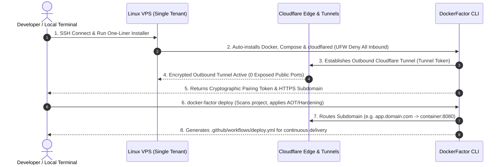

# 🛡️ DockerFactor

<div align="center">

```text
  ____   ___   ____ _  _____ ____  _____ _    ____ _____ ___  ____  
 |  _ \ / __ \ / ___| |/ / __|  _ \|  ___/ \  / ___|_   _/ _ \|  _ \ 
 | | | | |  | | |   | ' /|  _| |_) | |_ / _ \| |     | || | | | |_) |
 | |_| | |__| | |___| . \| |__|  _ <|  _/ ___ \ |___  | || |_| |  _ < 
 |____/ \____/ \____|_|\_\____|_| \_\_|/_/   \_\____| |_| \___/|_| \_\
```

**Experimental CLI for hardened Docker Compose deployments and outbound-only ingress**

[]()
[](LICENSE)
[]()
[]()

[Motivation](#-motivation) • [Features](#-key-features) • [Architecture](ARCHITECTURE.md) • [Quick Start](#-quick-start) • [CLI Reference](#-cli-commands) • [Roadmap](#-roadmap)

</div>

> [!IMPORTANT]
> DockerFactor is an early-stage open source project under active development. It is not yet production-ready. Some commands are prototypes, while the VPS agent, cryptographic pairing, managed deployment and verified security-audit workflows described in the architecture are planned capabilities.

## Current scope

The first functional increment provides a strict, versioned `dockerfactor.yaml` contract and a read-only `inspect` command. It parses real YAML, rejects unknown or duplicate fields and reports stable validation codes suitable for local use and CI.

DockerFactor does not currently provide a production control plane, functional mTLS enrollment, continuous reconciliation, immutable audit storage, blue/green deployments or automatic rollback.

---

## 💡 Motivation

**DockerFactor** was born out of a real-world infrastructure pain point. 

When deploying containerized applications to isolated Virtual Private Servers (VPS) for enterprise clients, traditional methods force bad trade-offs:
- **Security Risks:** Publicly exposing SSH (`22`) and web ports (`80/443`) invites constant brute-force attacks and DDoS.
- **Resource Waste:** Heavy self-hosted web panels consume 200MB–500MB of RAM just to run the management GUI on small servers.
- **Insecure Defaults:** Most Docker containers run as `root` without CPU/RAM limits, risking host compromise or Out-Of-Memory (OOM) crashes.

We needed a tool that could transform a fresh Linux VPS into a hardened, production-ready environment in **one single command**—with **zero public open ports**.

---

## 🚀 Key Features

* 🔒 **Outbound-Only Ingress Direction:** Designed around Cloudflare Tunnels (`cloudflared`) so applications can be published without binding public application ports.
* ⚡ **Lightweight CLI:** Built in **C# with Native AOT enabled** and Bash. Reproducible binary-size, startup and memory benchmarks will be published with releases.
* 🛡️ **Container Hardening Templates:** Generates Dockerfiles and Compose manifests with non-root execution, read-only filesystems, dropped capabilities and resource limits. These controls must still be verified for each application stack.
* 📋 **Declarative Specification (`dockerfactor.yaml`):** Developers declare their build step (`build`), start command (`command`), and designated listening port (`port`).
* 🤖 **Planned CI/CD:** GitHub Actions generation and zero-downtime rollout orchestration are roadmap items.

---

## 🤝 Shared Responsibility Model

DockerFactor strictly delineates infrastructure security boundaries from application code logic:

| Developer Responsibility | DockerFactor Responsibility |
| :--- | :--- |
| **Application Dockerizability:** Ensure code compiles (`build`) and runs in Linux/headless environments. | **Host & Zero-Trust Hardening:** Deny all public inbound ports (UFW / `DOCKER-USER` iptables). |
| **Declarative Spec:** Define start command (`command`) and designated listening port (`port`) in `dockerfactor.yaml`. | **Container Security Defaults:** Enforce `USER 10001:10001`, `read_only: true`, `tmpfs /tmp`, `cap_drop: [ALL]`. |
| **Environment & Secrets:** Provide application environment variables and database connections. | **Ingress Tunnel Orchestration:** Manage encrypted outbound mTLS & Cloudflare Tunnels. |
* 📊 **Planned Auditor:** Evidence-based container and host checks will be added after the manifest and local lifecycle foundations are stable.

---

## 🏗️ Architecture



---

## ⚡ Quick Start

### Inspect the example manifest

```bash
dotnet run --project src/DockerFactor.CLI -- inspect examples/hello-api
```

---

## 💻 CLI Commands

| Command | Status | Current behavior |
| :--- | :--- | :--- |
| `docker-factor inspect [DIR]` | Implemented | Read-only parsing and strict validation of `dockerfactor.yaml`. |
| `docker-factor init` | Planned | Safe stack detection and artifact generation. |
| `docker-factor tunnel` | Planned | Managed lifecycle for ephemeral and named ingress routes. |
| `docker-factor deploy` | Planned | Reproducible local and remote deployment lifecycle. |
| `docker-factor audit` | Planned | Evidence-based host and container checks. |
| `docker-factor connect` | Planned | One-time server enrollment and workload identity. |
| `docker-factor list` | Planned | Observed applications and ingress state. |
| `docker-factor destroy` | Planned | Complete, verified container and ingress teardown. |
| `docker-factor stats` | Planned | Interactive resource and log monitoring. |
| `docker-factor init-ci` | Planned | GitHub Actions workflow generation. |

---

## 🗺️ Project Roadmap

- [x] Initial architecture and security-engine drafts (`v1alpha1`)
- [x] CLI skeleton and experimental Quick Tunnel adapter
- [x] Initial hardening generators for common application stacks
- [ ] **Stage 1:** Define the MVP, support matrix and acceptance criteria
- [ ] **Stage 2:** Versioned `dockerfactor.yaml` schema and strict validation
- [ ] **Stage 3:** Safe and tested stack detection and artifact generation
- [ ] **Stage 4:** Verifiable container-hardening baseline
- [ ] **Stage 5:** Reliable local deployment lifecycle and state management
- [ ] **Stage 6:** Evidence-based audit engine
- [ ] **Stage 7:** Managed and ephemeral ingress lifecycle
- [ ] **Stage 8:** Recoverable VPS bootstrap and firewall hardening
- [ ] **Stage 9:** One-time pairing, workload identity and outbound agent
- [ ] **Stage 10:** Signed artifacts, CI/CD, observability and automatic rollback

---

## 🛠️ Built With

* **CLI Engine:** C# (.NET 10 Native AOT) & Bash
* **Terminal UI:** [Spectre.Console](https://spectreconsole.net/)
* **Ingress Security:** Cloudflare Tunnels (`cloudflared`) & Linux UFW / nftables
* **Runtime:** Docker Engine & Docker Compose V2

---

## 📄 License

Distributed under the **MIT License**. See `LICENSE` for more information.

---

<div align="center">

Crafted with ❤️ by **Miguel Valdez** ([@migueval](https://github.com/migueval))  
*Solutions & Software Architect • Zero-Trust & Distributed Systems Specialist*

</div>
