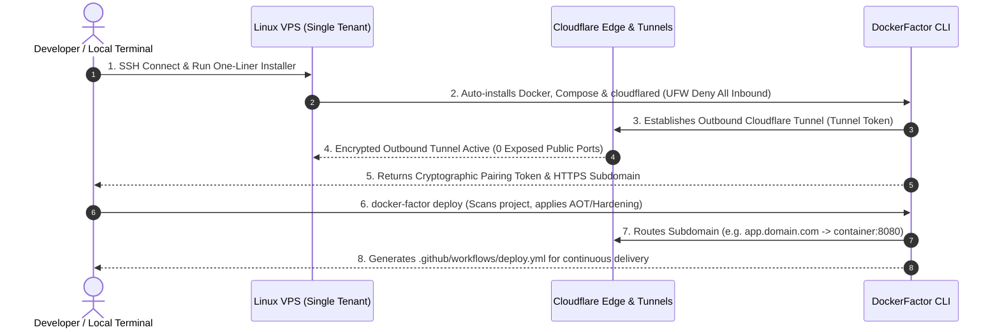

# 🛡️ DockerFactor

<div align="center">

```text
  ____   ___   ____ _  _____ ____  _____ _    ____ _____ ___  ____  
 |  _ \ / __ \ / ___| |/ / __|  _ \|  ___/ \  / ___|_   _/ _ \|  _ \ 
 | | | | |  | | |   | ' /|  _| |_) | |_ / _ \| |     | || | | | |_) |
 | |_| | |__| | |___| . \| |__|  _ <|  _/ ___ \ |___  | || |_| |  _ < 
 |____/ \____/ \____|_|\_\____|_| \_\_|/_/   \_\____| |_| \___/|_| \_\
```

**Zero-Inbound-Port VPS Provisioning, Cloudflare Tunnels & Hardened Container CLI**

[]()
[](LICENSE)
[]()
[]()

[Motivation](#-motivation) • [Features](#-key-features) • [Architecture](#-architecture) • [Quick Start](#-quick-start) • [CLI Reference](#-cli-commands) • [Roadmap](#-roadmap)

</div>

---

## 💡 Motivation

**DockerFactor** was born out of a real-world infrastructure pain point. 

When deploying containerized applications to isolated Virtual Private Servers (VPS) for enterprise clients, traditional methods force bad trade-offs:
- **Security Risks:** Publicly exposing SSH (`22`) and web ports (`80/443`) invites constant brute-force attacks and DDoS.
- **Resource Waste:** Heavy self-hosted web panels consume 200MB–500MB of RAM just to run the management GUI on small servers.
- **Insecure Defaults:** Most Docker containers run as `root` without CPU/RAM limits, risking host compromise or Out-Of-Memory (OOM) crashes.

We needed a tool that could transform a fresh Linux VPS into a hardened, production-ready environment in **one single command**—with **zero public open ports**.

---

## 🚀 Key Features

* 🔒 **Zero Open Inbound Ports:** Integrates natively with Cloudflare Tunnels (`cloudflared`). Your UFW firewall denies ALL public incoming traffic while Cloudflare handles SSL/TLS, WAF, and Anti-DDoS at the Edge.
* ⚡ **Ultra-Fast & Zero Overhead:** Built in **C# (.NET 10 Native AOT)** and **Bash**. Compiles to a single standalone binary (<20MB) with sub-millisecond startup and <15MB RAM usage.
* 🛡️ **Smart Container Hardening:** Automatically generates production-grade Dockerfiles incorporating `USER 10001` (non-root), `readOnlyRootFilesystem: true`, *Chiseled Ubuntu / Distroless* bases, and strict cgroup limits.
* 🤖 **Automated CI/CD:** Auto-generates pre-configured GitHub Actions workflows (`.github/workflows/deploy.yml`) for seamless Zero-Downtime rolling updates.
* 📊 **Terminal UI & 12-Factor Auditor:** Live terminal monitoring (`docker-factor stats`) and automated compliance checking against the 12-Factor App methodology.

---

## 🏗️ Architecture



---

## ⚡ Quick Start

### 1. Provision a Fresh VPS (One-Liner)

Connect to your target Linux VPS via SSH and run:

```bash
curl -fsSL https://raw.githubusercontent.com/migueval/dockerfactor/main/install.sh | bash
```

This script automatically installs Docker Engine, Compose V2, `cloudflared`, closes all inbound firewall ports, and outputs your **Secure Pairing Token**.

### 2. Pair and Deploy from Local Machine

Connect your local machine to the VPS and deploy your project:

```bash
# Pair with target VPS
docker-factor connect <YOUR_MAGIC_TOKEN>

# Smart Dockerize & Deploy
docker-factor deploy
```

---

## 💻 CLI Commands

| Command | Description |
| :--- | :--- |
| `docker-factor init` | Scans directory (.NET, Node, Go) and generates hardened `Dockerfile` & `compose.yaml` |
| `docker-factor deploy` | Builds, hardens, provisions containers and binds Cloudflare Tunnel routing |
| `docker-factor stats` | Opens interactive live Terminal UI (CPU%, RAM MB, log streamer) |
| `docker-factor audit` | Runs a 12-Factor App compliance & Zero-Trust security scan |
| `docker-factor init-ci` | Generates ready-to-use `.github/workflows/deploy.yml` for automated CI/CD |

---

## 🗺️ Project Roadmap

- [x] Architectural Specification & Threat Modeling (`v1alpha1`)
- [ ] **Phase 1:** One-Line Installer Script (`install.sh`) & UFW Hardening
- [ ] **Phase 2:** Cloudflare Tunnel Automation & Ingress Routing Engine
- [ ] **Phase 3:** Core .NET 10 Native AOT CLI & Terminal UI (Spectre.Console)
- [ ] **Phase 4:** Smart Docker Hardening Generator (.NET AOT, Node, Go)
- [ ] **Phase 5:** Automated GitHub Actions Generator & Zero-Downtime Rollouts

---

## 🛠️ Built With

* **CLI Engine:** C# (.NET 10 Native AOT) & Bash
* **Terminal UI:** [Spectre.Console](https://spectreconsole.net/)
* **Ingress Security:** Cloudflare Tunnels (`cloudflared`) & Linux UFW / nftables
* **Runtime:** Docker Engine & Docker Compose V2

---

## 📄 License

Distributed under the **MIT License**. See `LICENSE` for more information.

---

<div align="center">

Crafted with ❤️ by **Miguel Valdez** ([@migueval](https://github.com/migueval))  
*Solutions & Software Architect • Zero-Trust & Distributed Systems Specialist*

</div>

