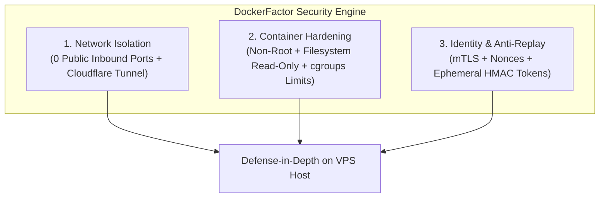

# DockerFactor — Security Engine & Container Hardening Specification

**Status:** Target security design — not a certification of the current prototype
**Author:** Miguel Valdez ([@migueval](https://github.com/migueval))  
**License:** MIT  

> [!WARNING]
> Controls in this document are considered implemented only when they have executable checks, automated tests and evidence from a supported environment. The `docker-factor audit` command is not implemented yet. Operators must independently validate firewall rules, exposed sockets, container privileges, image provenance and tunnel configuration.

> **Transparency & Standards Alignment Notice:**  
> DockerFactor's security engine policies have been designed **taking as reference guidelines and best practices** the recommendations from the **NIST SP 800-63-3** and **OWASP ASVS v4.0** frameworks. Using this tool helps enforce technical infrastructure controls inspired by these guidelines, but **does not constitute a formal accreditation, compliance level, or audit certification by external auditors**.

---

## 🔍 Technical Alignment with Cybersecurity Best Practices

Rather than claiming a full formal compliance level (which would require evaluating all standard controls by an accredited auditing body), DockerFactor focuses on implementing **specific defensive technical controls** recommended by the cybersecurity community:

1. **Absolute Perimeter Isolation (Network Configuration Controls):**
   * Complete elimination of public inbound listeners on the host IP (**0 public inbound ports**).
   * Encapsulation of all ingress traffic exclusively through encrypted outbound tunnels (`cloudflared`) with Edge WAF filtering.

2. **Least Privilege Execution & Immutability (Container Hardening):**
   * **Non-Root Execution:** Enforced execution as non-root `USER 10001`.
   * **Disk Immutability:** Read-only root filesystem (`read_only: true`), preventing persistent attackers from writing binaries to the container disk.
   * **Capability Stripping:** Complete removal of non-essential Linux kernel capabilities (`cap_drop: [ALL]`) and privilege escalation blocks (`no-new-privileges:true`).

3. **Cryptographic Authentication & Anti-Replay (Token Management):**
   * Ephemeral 256-bit CSPRNG tokens stored exclusively via one-way SHA-256 hashes.
   * Replay attack prevention using HMAC-SHA256 digital signatures, 30-second timestamp windows, and single-use `nonces`.

4. **Local Denial-of-Service Defense (Resource Controls):**
   * Strict cgroup RAM, CPU, and PID limits per container, preventing a compromised container from causing a host-wide crash (*OOM Killer / Fork Bomb*).

---

## 1. Security Engine Philosophy

The DockerFactor Security Engine operates not as an optional add-on layer, but as an **invariant structural constraint** based on three core pillars:



---

## 2. Network Isolation Module (Zero Open Inbound Ports)

### 2.1 Host Firewall Policy (UFW / nftables)
By default, the engine applies a **Deny All Inbound** policy on the public network interface of the server:

```bash
# Deny all incoming public traffic by default
ufw default deny incoming
ufw default allow outgoing

# Allow traffic exclusively on loopback interface (127.0.0.1)
ufw allow in on lo

# Enable firewall
ufw enable
```

### 2.2 `DOCKER-USER` Chain Control (Bypass Prevention)
To prevent the Docker daemon from automatically opening ports on the public interface (`eth0`), DockerFactor injects priority rules into the `DOCKER-USER` iptables chain:

```bash
# Block automatic Docker port publications toward the public IP
iptables -I DOCKER-USER -i eth0 -j DROP
iptables -I DOCKER-USER -i eth0 -m state --state ESTABLISHED,RELATED -j ACCEPT
```

### 2.3 Outbound Encrypted Ingress via Cloudflare Tunnel (`cloudflared`)
User traffic flows filtered from Cloudflare’s Edge Network (WAF + SSL) into the container through an **encrypted outbound connection** (outbound TCP/UDP port `7844`):

```text
[ User / Internet ]
         │ (HTTPS 443 + Edge SSL Certificate + WAF)
         ▼
[ Cloudflare Edge Network ]
         │ (Encrypted Outbound Connection - 0 Exposed Public Ports on VPS)
         ▼
[ cloudflared Daemon on VPS ]
         │ (Internal DockerFactor Container Network)
         ▼
[ Application Container (non-root:10001) ]
```

---

## 3. Container Hardening Module

Every container provisioned or deployed by DockerFactor is configured according to the following **resource isolation and attack surface reduction best practices**:

### 3.1 Hardening Control Matrix

| Security Control | Implementation in Docker / Compose | Threat Mitigated |
| :--- | :--- | :--- |
| **Non-Root Execution** | `USER 10001` (non-root) | Mitigates host privilege escalation in the event of a container breakout. |
| **Immutable Root Filesystem** | `read_only: true` | Prevents malware from writing or modifying binaries on the container disk. |
| **Isolated RAM Temporary Directory** | `tmpfs: /tmp:rw,noexec,nosuid` | Enables temporary in-memory writes while preventing execution of unauthorized scripts. |
| **Capability Dropping** | `cap_drop: [ALL]` | Disables non-essential Linux kernel capabilities (e.g., raw sockets or time manipulation). |
| **Privilege Escalation Block** | `security_opt: [no-new-privileges:true]` | Prevents processes from executing binaries with `suid` / `sgid` flags inside the container. |
| **RAM Memory Constraints** | `mem_limit: 256m` | Reduces the risk of a container with memory leaks crashing the VPS (*Out-Of-Memory Killer*). |
| **CPU & PID Bounds** | `cpus: 0.5` / `pids_limit: 100` | Limits the impact of local Denial-of-Service attacks (*Fork Bombs* / CPU exhaustion). |
| **Docker Socket Prohibition** | No `/var/run/docker.sock` mount | Prevents a compromised application from controlling the host Docker daemon. |

---

## 4. Cryptographic Identity, Pairing & Anti-Replay Module

### 4.1 Ephemeral HMAC Pairing Token (CLI ↔ VPS)
To pair the developer's terminal with the VPS without storing static SSH keys on CI/CD runners:

1. The `install.sh` script generates a single-use **256-bit CSPRNG Cryptographic Token** with a short TTL (15 minutes).
2. The server stores ONLY the **SHA-256 hash of the token** (never the raw plaintext token).
3. Upon successful pairing, the token is invalidated and a revocable mTLS agent credential is issued for subsequent operations.

### 4.2 Replay Attack Prevention (*Anti-Replay*)
Every administrative request sent to the agent includes:
- `timestamp` of the operation (with a maximum tolerance window of 30 seconds);
- single-use cryptographic `nonce`;
- **HMAC-SHA256** digital signature of the request payload.

---

## 5. Real-Time Posture Auditor Module (`docker-factor audit`)

The `docker-factor audit` command analyzes active containers and server host rules in real-time, emitting a security posture score:

```text
[AUDIT] Initiating Zero-Trust security posture audit on VPS...

✔ [PASS] UFW Firewall active and verified (0 public inbound ports exposed).
✔ [PASS] Container 'identity-service' running as USER 10001 (non-root).
✔ [PASS] Container 'identity-service' with readOnlyRootFilesystem=true.
✔ [PASS] Container 'identity-service' with allocated RAM limits (512MB).
✔ [PASS] Outbound Cloudflare Tunnel active and encrypted.
⚠️ [WARN] Container 'legacy-api' has no PID limit set (potential Fork Bomb risk).

Posture Score: 95/100 (Grade A - Hardened Environment)
```

---

## 6. Conclusion

The DockerFactor Security Engine does not promise absolute invulnerability. Instead, it provides a **pragmatic, automated, and auditable defense-in-depth strategy** designed to dramatically reduce technical risk and maintain operational continuity on VPS hosts.
